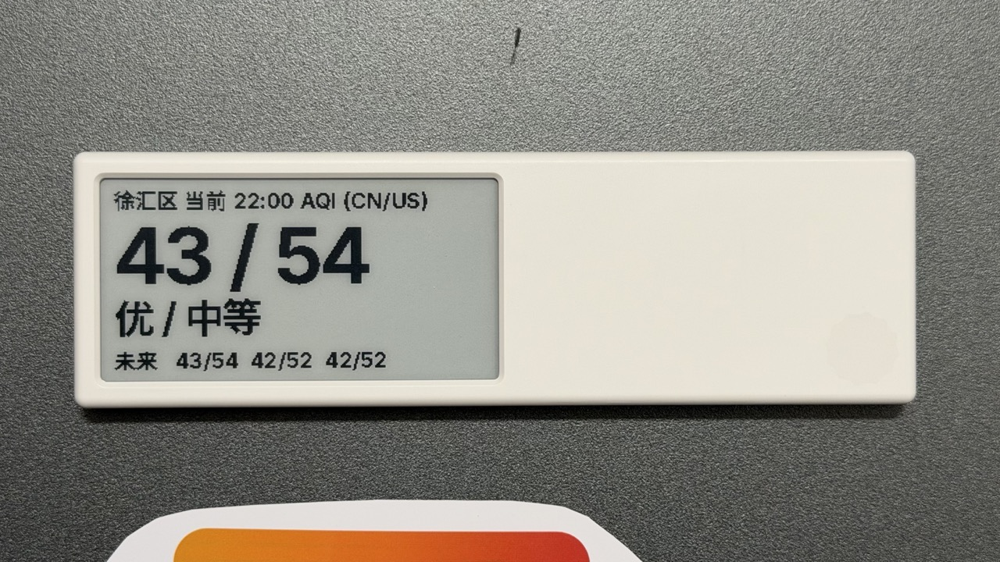

# quote-aqi

Display real-time Air Quality Index (AQI) data on your [Quote/0](https://dot.mindreset.tech/docs/quote_0) e-ink device.



## Features

- 🌫️ Real-time AQI data from [彩云天气 API](https://platform.caiyunapp.com)
- 🇨🇳 🇺🇸 Dual AQI standards (China & USA) with localized descriptions
- 📊 With 3-hour forecast at a glance
- 🖼️ Optimized rendering for Quote/0's 296×152 e-ink display
- ⚙️ Flexible configuration via TOML file or environment variables

## Prerequisites

- [uv](https://docs.astral.sh/uv/) package manager
- A [Quote/0 device](https://dot.mindreset.tech/docs/quote_0) with [Image API](https://dot.mindreset.tech/docs/service/studio/api/image_api) enabled
- [彩云天气 API](https://platform.caiyunapp.com) credentials

## Installation

```bash
# Clone the repository
git clone https://github.com/microdog/quote-aqi.git
cd quote-aqi

# Install dependencies
uv sync
```

## Configuration

Create a `config.toml` file in the project root (or set `QUOTE_AQI_CONFIG_FILE` to specify a custom path):

```toml
# Location coordinates (GCJ-02)
longitude = 121.436307
latitude = 31.188334
poi = "徐汇区"  # Point of Interest name displayed on screen

# 彩云天气 API credentials
# Get your API key at https://platform.caiyunapp.com
caiyun_app_key = "your_caiyun_app_key"
caiyun_app_secret = "your_caiyun_app_secret"

# Quote/0 API credentials
# Get your API key at https://dot.mindreset.tech/docs/service/studio/api/get_api
# Get your device ID at https://dot.mindreset.tech/docs/service/studio/api/get_device_id
dot_api_key = "dot_app_xxxxx"
dot_quote0_device_id = "YOUR_DEVICE_ID"
dot_quote0_link = "https://example.com"  # Optional: NFC tap redirect URL
```

### Environment Variables

You can also configure the application using environment variables with the `QUOTE_AQI_` prefix:

```bash
export QUOTE_AQI_LONGITUDE=121.436307
export QUOTE_AQI_LATITUDE=31.188334
export QUOTE_AQI_POI="徐汇区"
export QUOTE_AQI_CAIYUN_APP_KEY="your_key"
export QUOTE_AQI_CAIYUN_APP_SECRET="your_secret"
export QUOTE_AQI_DOT_API_KEY="dot_app_xxxxx"
export QUOTE_AQI_DOT_QUOTE0_DEVICE_ID="YOUR_DEVICE_ID"
```

## Usage

Run the application to fetch AQI data and update your Quote/0 display:

```bash
uv run quote-aqi
```

Or run as a Python module:

```bash
uv run python -m quote_aqi
```

### Automation with Cron

To keep your Quote/0 display updated, set up a cron job:

```bash
# Update every hour
0 * * * * cd /path/to/quote-aqi && uv run quote-aqi
```

## Display Layout

The generated image displays:

- **Header**: Location name, current time, and AQI label
- **Main**: Current AQI values (China/USA standards)
- **Description**: Air quality category in both standards
- **Footer**: 3-hour forecast AQI values

## TODO

- [ ] Multi-language support for displayed texts (currently Chinese only)
- [ ] Customizable display layout templates
- [ ] Support for additional weather data providers

## Related Links

- [Quote/0 Device](https://dot.mindreset.tech/docs/quote_0)
- [Image API Documentation](https://dot.mindreset.tech/docs/service/studio/api/image_api)
- [彩云天气 API](https://platform.caiyunapp.com)

## License

MIT
